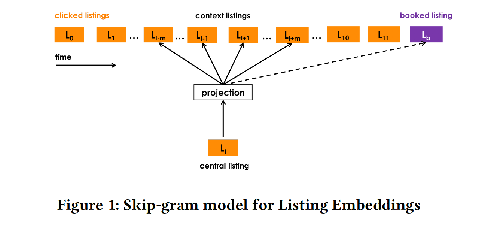
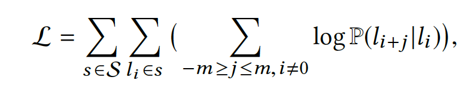
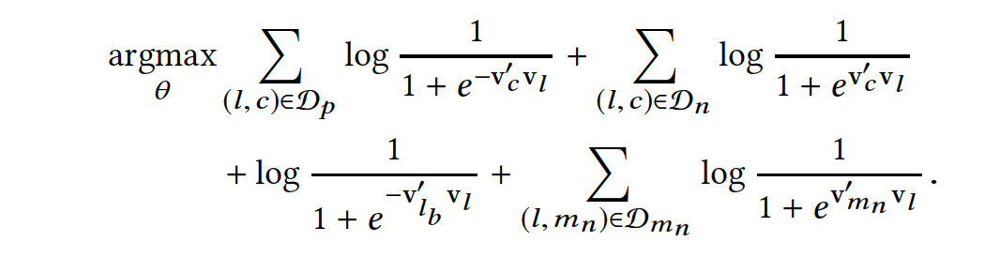
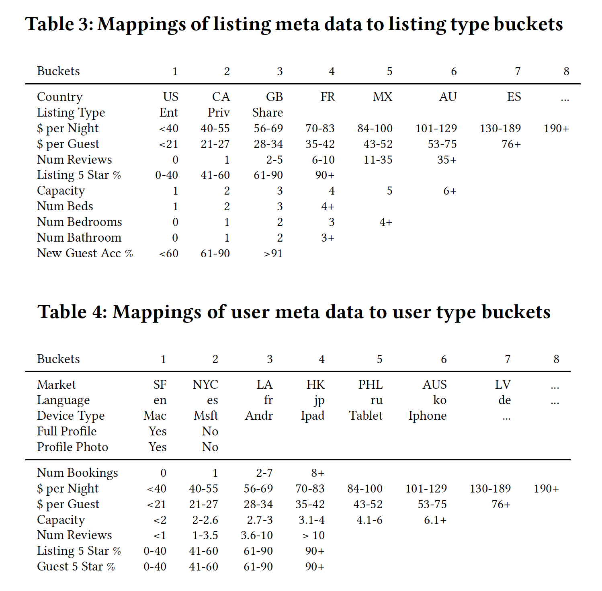
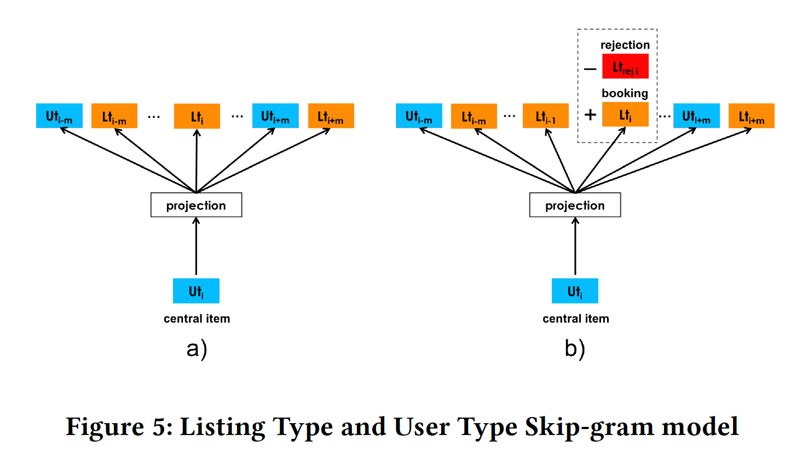
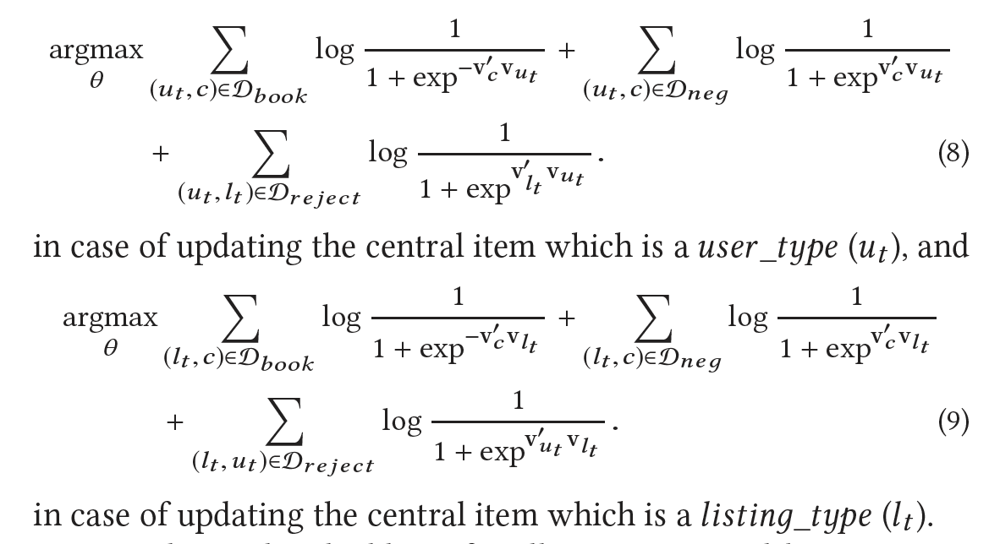

Real-time Personalization using Embeddings for Search Ranking at Airbnb

## 本文的亮点

1. Real-time Personalization：根据用户在线的实时浏览行为，实时更新用户兴趣，找到相似item
2. Adapting Training for Congregated Search：这种出行场景往往聚集在一个目的地，所以可以聚集在一个区域市场内训练embedding，负采样可以限制在该区域市场内，可以捕捉到同一个区域市场内的民宿差异。
3. Leveraging Conversions as Global Context：如果session最后为下单行为，将下单的民宿作为global context，在用skip-gram的时候，每个window都会对这个global context进行预测。强行加入global context与这个session中的序列的相关性。
4. User Type Embeddings：直接用uid训练，数据太过于稀疏，可以把同类的user聚合到一起，构建序列，训练embedding
5. Rejections as Explicit Negatives：将host rejections作为负样本

## listing embedding&用户短期兴趣

通过session构建训练skip-gram的语料。

session构建规则：30分钟没行为就切割，停留时间短的id去除，去掉只有一个id的session。总共有800M的session作为语料。

原始的目标函数：

其中：$s=\left(l_{1}, \ldots, l_{M}\right) \in \mathcal{S}$

$\mathbf{v}_{l} $  和 $ \mathbf{v}_{l}^{\prime}$ 分别表示 listing $l$输入和输出的向量表征。
$|\mathcal{V}|$是词表大小，一般会很大，影响计算效率。所以需要优化，一般可以用层序softmax和负采样，这里以负采样为例。优化后的公式如下：
$$
\underset{\theta}{\operatorname{argmax}} \sum_{(l, c) \in \mathcal{D}_{p}} \log \frac{1}{1+e^{-\mathbf{v}_{c}^{\prime} \mathbf{v}_{l}}}+\sum_{(l, c) \in \mathcal{D}_{n}} \log \frac{1}{1+e^{\mathbf{v}_{c}^{\prime} \mathbf{v}_{l}}}
$$

$$
\begin{array}{l}\text { where parameters } \theta \text { to be learned are } \mathbf{v}_{l} \text { and } \mathbf{v}_{c}, l, c \in \mathcal{V} . \text { The } \\ \text { optimization is done via stochastic gradient ascent. }\end{array}
$$

到此为止都是非常常规的skip-gram操作。Airbnb把session分为：booked sessions和exploratory sessions。显而易见，一个以下单结尾，一个只会用户只是看看。语料中对booked sessions过采样了5倍，得到更好的效果。

Airbnb把Booked Listing 作为 Global Context，不仅预测滑窗中的id，也预测下单的id。

所以，对于booked sessions，优化目标变成：
$$
\underset{\theta}{\operatorname{argmax}} \sum_{(l, c) \in \mathcal{D}_{p}} \log \frac{1}{1+e^{-\mathbf{v}_{c}^{\prime} \mathbf{v}_{l}}}+\sum_{(l, c) \in \mathcal{D}_{n}} \log \frac{1}{1+e^{\mathbf{v}_{c}^{\prime} \mathbf{v}_{l}}}+\log \frac{1}{1+e^{-\mathbf{v}_{l}^{\prime} \mathbf{v}_{l}}}
$$

$$
\text { where } \mathbf{v}_{l_{b}} \text { is the embedding of the booked listing } l_{b} \text { . }
$$

然后，对于民宿的浏览和预定，往往都是在同一个地区（去某地旅行，找某地的住宿），所以在负样本的选取上，Airbnb加入了同一个地区的负样本，可以捕捉到同一个区域市场内的民宿差异，目标函数变为：

$$
\mathcal{D}_{m_{n}} \text { sampled from the market of the central listing } l \\
\text { where parameters } \theta \text { to be learned are } \mathbf{v}_{l} \text { and } \mathbf{v}_{c}, l, c \in \mathcal{V}
$$

冷启动：对于OOV，新的民宿，用其邻近区域，同样房型，同样价格带的3个向量做平均。

## User-type & Listing-type Embeddings

上述得到的session listing embedding，可以在session中用作listing的相似查找，表征用户的短期兴趣做相似房源推荐。然而对于用户的长期兴趣的表征也非常重要，反应用户的长期偏好。更好的序列构造方法是用用户的下单序列，但是直接根据UID构建序列，数据会很稀疏。

Airbnb用User-type & Listing-type 构建新的ID，代替原始的UID和Listing ID来进行序列构建和embedding学习，ID的维度会大大降低，数据的稀疏性问题得到了很好的解决。学习的目标变成了表征同一类人和同一类房源。具体的划分如下图所示：

user_type的计算会基于用户最近一次的下单行为汇总，如果是第一次下单，则只用Table 4的前五行标记user_type，这样得到的embedding也可以用于冷启动。

#### 训练过程

user_types 和 listing_types的embedding再同一个向量空间学习。

$s_{b}=\left(u_{t y p e_{1}} l_{t y p e_{1}}, \ldots, u_{t y p e_{M}} l_{t y p e_{M}}\right) \in \mathcal{S}_{b}$

$\mathcal{S}_{b}$是所有的booking session的集合，$\mathcal{s}_{b}$是其中的一个booking session。

$(u_{type}, l_{type})$ tuples ordered in time

优化目标如下，被房东拒绝的作为显式负样本：

## Reference

[不一样的论文解读2018 KDD best paper: Embeddings at Airbnb-吴海波-蘑菇街](https://zhuanlan.zhihu.com/p/49537461)

[从KDD 2018 Best Paper看Airbnb实时搜索排序中的Embedding技巧-王喆](https://zhuanlan.zhihu.com/p/55149901)

[Airbnb如何解决Embedding的数据稀疏问题？-王喆](https://zhuanlan.zhihu.com/p/57313656)

[Listing Embeddings in Search Ranking](https://medium.com/airbnb-engineering/listing-embeddings-for-similar-listing-recommendations-and-real-time-personalization-in-search-601172f7603e)

[Machine Learning-Powered Search Ranking of Airbnb Experiences](https://medium.com/airbnb-engineering/machine-learning-powered-search-ranking-of-airbnb-experiences-110b4b1a0789)

