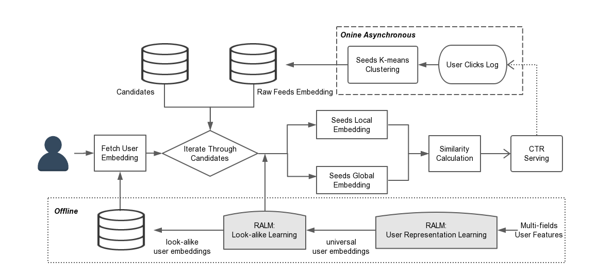
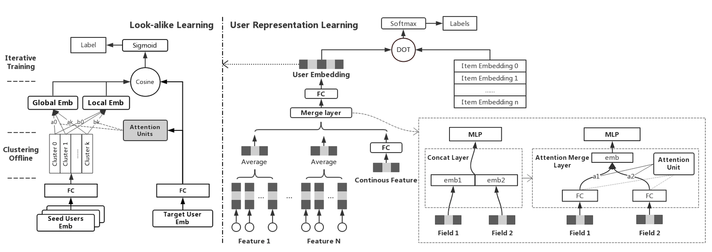

Real-time Attention Based Look-alike Model (RALM) for Recommender System

RALM is a similarity based look-alike model, which consists of user representation learning and look-alike learning.

很多DNN的推荐模型，都会有严重的热门偏好，使得推荐系统的马太效应（Matthew effect）显著，很多长尾 的优质内容得不到有效的流量支持。

seeds-to-user similarity calculation

- User Representation: 用attention merge layer代替concatenation

- Seeds Representation: global representation and local representation of seeds based on global and local attention units.

​	look-alike算法可以分成两类：similarity based methods and regression based methods.

流程：

---

local attention & global attention

 

