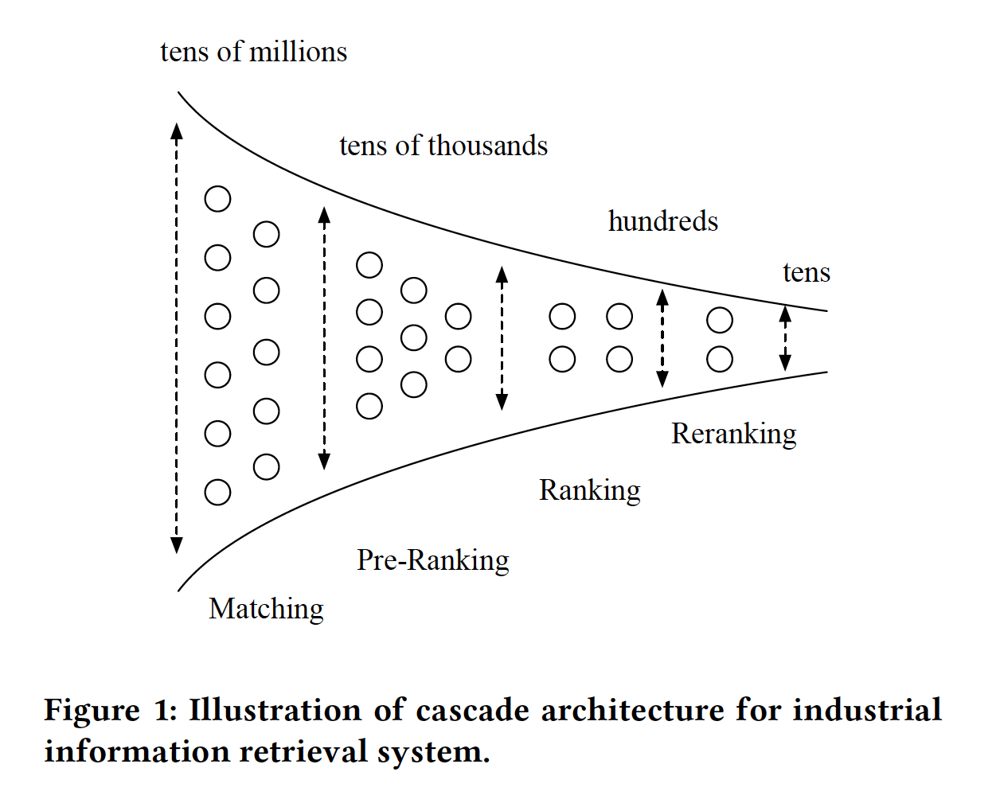
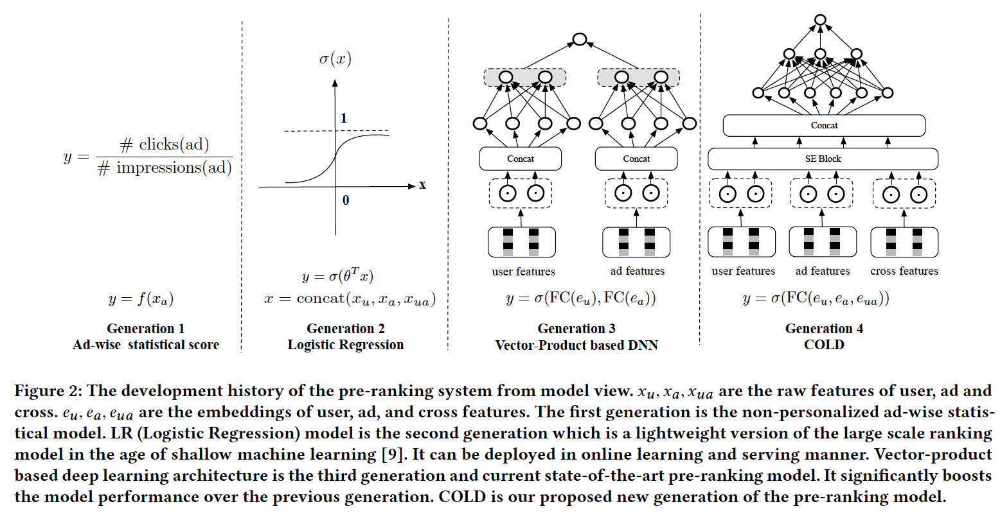

## COLD: Towards the Next Generation of Pre-Ranking System

COLD (Computing power cost-aware Online and Lightweight Deep pre-ranking system)

推荐/广告 在线系统通常可以分为4个部分【multi-stage cascade architecture】：

召回=>粗排=>精排=>重排

matching, pre-ranking, ranking, and reranking

粗排（pre-ranking）是精排的简化，通常用于缓解精排的压力，粗排的数量级大约是精排的10倍或更大。目前常用的方案是双塔的DNN结构，分为user和item独立的塔计算user emb和item emb的向量内积，user emb和item emb可以通过模型离线训练得到，但这样没法用到user和item的交叉特征，模型的效果受到了限制。

讨论粗排的论文较少：

- Cascade ranking for operational e-commerce search

- EENMF: An End-to-End Neural Matching Framework for E-Commerce Sponsored Search

粗排系统的发展历程：

- 第一个阶段是根据一些历史的CTR统计进行粗排
- 第二个阶段是用LR进行粗排
- 第三个阶段是双塔DNN的结构，这个结构虽然相比于前面两个阶段有了质的提升，但是也有其局限性。比如：受限于serving的响应时间限制，模型没法太复杂，模型的表达能力不足；模型的更新频率没法太高，user和item的emb是模型离线训练得到的，如果数据分布变化太大将会带来结果偏差（如双十一这样的情形）
- 第四个即为新一代的COLD (Computing power cost-aware Online and Lightweight Deep pre-ranking system)，很好的平衡了模型的性能和计算复杂度

FiBiNET: Combining Feature Importance and Bilinear feature Interaction for Click-Through Rate Prediction
AutoFIS: Automatic Feature Interaction Selection in Factorization Models for Click-Through Rate Prediction

采用SE (Squeeze-and-Excitation) block进行特征筛选。采用GAUC, QPS, RT进行评估。

在数据分布变化巨大的场景下，COLD比前一代基于向量点积的DNN模型，优势更为明显。

## Reference

[阿里定向广告最新突破：面向下一代的粗排排序系统COLD](https://zhuanlan.zhihu.com/p/63528599)

