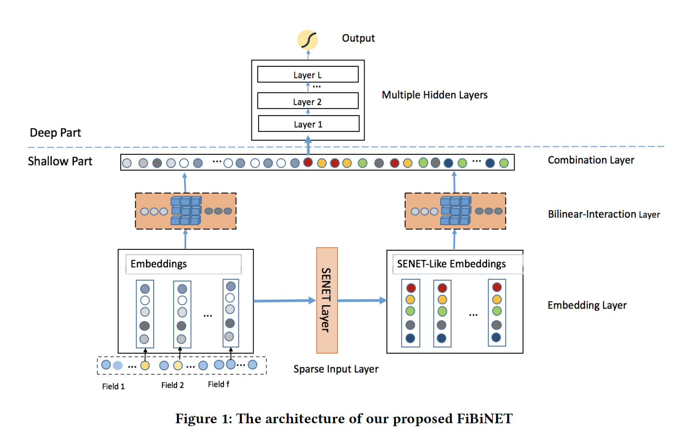
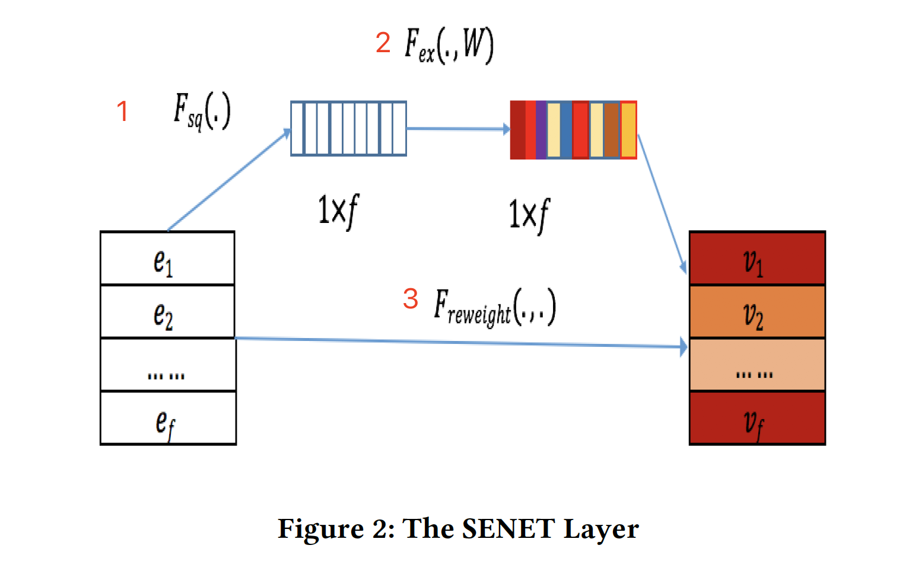
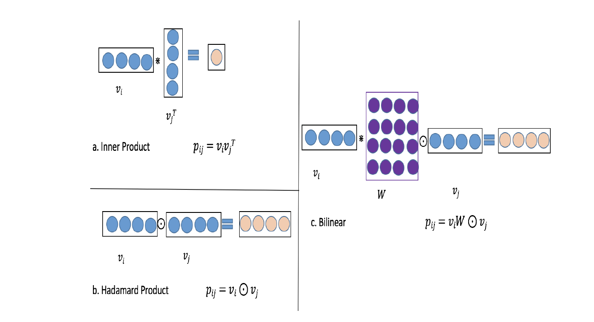

[FiBiNET: Combining Feature Importance and Bilinear feature Interaction for Click-Through Rate Prediction](./FiBiNET-Combining-Feature-Importance-and-Bilinear-feature-Interaction-for-Click-Through-Rate-Prediction.pdf)

之前模型盘点：

FM/FFM: 

FFN: 用FM去预训练embedding，但是只有高阶的特征组合

WDL: Wide部分记忆，Deep部分泛化，但是Wide部分还是需要自己手动特征交叉

DeepFM: 用FM代替WDL的Wide部分，实现自动特征交叉。FM和Deep部分共享Embedding

DCN: 显式特征交叉

xDeepFM: 高阶和低阶的显式特征交叉

AFM: FM做不同特征之间的交叉不是同等重要的，加入attention机制

DIN: 用户兴趣具有多样性，根据目标ad做attention

### SENET的结构

分成1-2-3三个部分，分别是Squeeze, Excitation和Re-Weight

简单来说，SENET用两层全连接动态学习每个特征（域）的权重，加入注意力机制。

### Bilinear-Interaction Layer

两种传统的特征交叉方法：点积和Hadamard积

$$
Inner\ Product: \left\{\left(v_{i} \cdot v_{j}\right) x_{i} x_{j}\right\}(i, j) \in R_{x}
$$

$$
Hadamard\ Product: \left\{\left(v_{i} \odot v_{j}\right) x_{i} x_{j}\right\}(i, j) \in R_{x}
$$

