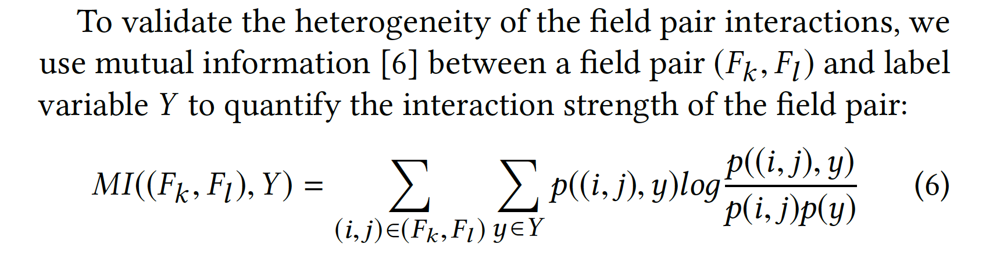
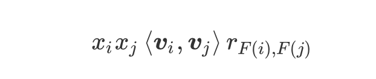
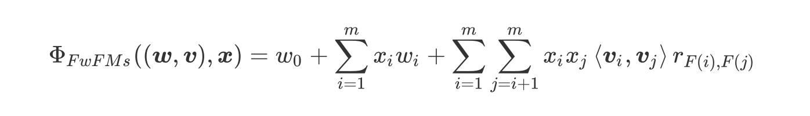
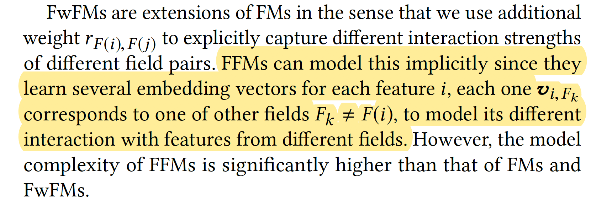
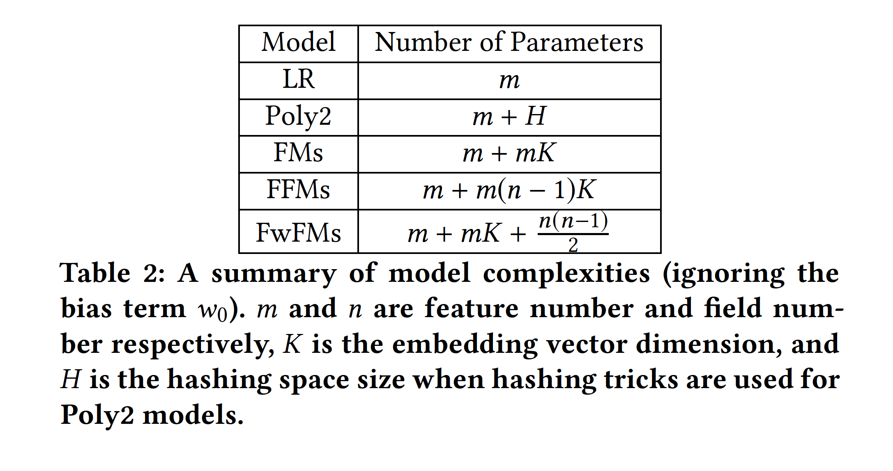
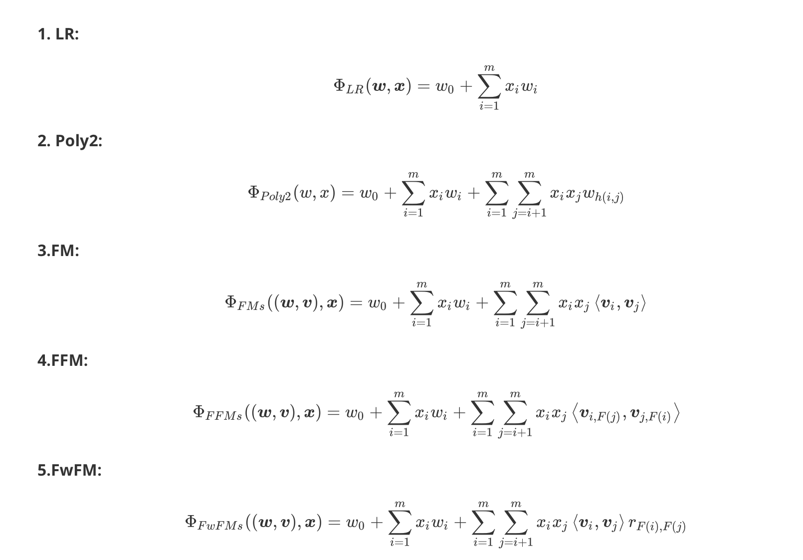
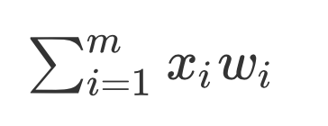
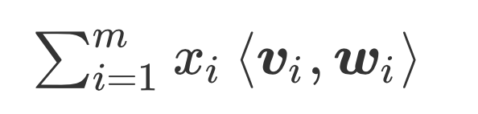
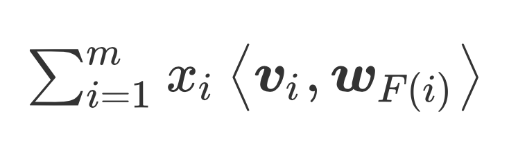

[FwFM-Field-weighted Factorization Machines for Click-Through Rate Prediction in Display Advertising](FwFM-Field-weighted Factorization Machines for Click-Through Rate Prediction in Display Advertising.pdf)

FFM的参数量巨大一直饱受诟病。Field-weighted Factorization Machines (FwFMs) 参数量比FFM少很多，但是也可以达到和FFM差不多的效果。

不同域的特征交叉带来的效果有很大的差异，我们可以用互信息来进行验证。Mutual Information（互信息）可用于衡量和对比不同特征交叉的强度。

正是由于不同特征域的组合重要性不一样，由此提出了Field-weighted Factorization Machines(FwFMs)模型，直接对不同域差异化的组合强度建模。特征交叉为：

其中$r_{F(i), F(j)}$是$F(i)$和$F(j)$特征域交叉的权重，来显式得表征不同特征域交叉的重要性是有差异的（FFM可以隐式表达这种差异）。FwFMs完整公式如下：

FMs/FFMs/FwFMs的对比：

参数比较：

由于通常n<<m，FwFM的参数量接近FM，但是远小于FFM。

不同模型的公式表达：

FwFM在线性部分的不同形式：

1. 原始的形式：

    

2. 将特征的embedding加入线性项：

此时参数量为mK，m是特征数

3. 如果将参数从feature-wise改成field-wise，同一个特征域共享一个权重系数，则：

此时参数量为nK，n是特征域的数。

