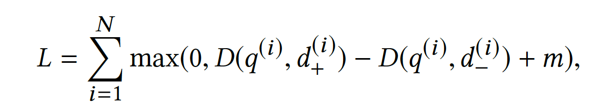
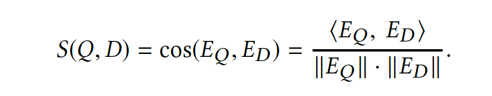

# Embedding-based Retrieval in Facebook Search

Embedding-based Retrieval in Facebook Search - KDD2020

如果说排序是特征的艺术，那么召回就是样本的艺术，特别是负样本的艺术。负样本的选择对于召回算法的成败是决定性的。

## 基础概括

- 模型
    - 老生常谈的双塔模型。双塔避免底层就出现特征交叉，方便拆分模型使doc embedding进入FAISS。
    - 双塔模型不是唯一的，只要<user,doc>的匹配得分能够表达成user embedding/doc embedding内积或cosine的形式，比如FM，都适用于召回。

> In modeling, we proposed unified embedding, which is a two sided model where one side is search request comprising query text, searcher, and context, and the other side is the document.

Unified embedding相比于text embedding可以加入更多的个性化。

- Loss: Pairwise Hinge Loss

m是阈值，控制query和正负样本的距离差，距离差可以用1-cos相似度来表示。

所以cos距离可以表示为：$1-cos(E_{Q}-E_{D})$

同一个用户与正文章的相似度要比同一个用户与负文章的相似度，高于一定的阈值。

尽管不同召回算法有不同的loss，但是背后基于Pairwise LTR的思想都是共通，这一点与排序时采用binary cross entropy loss有较大的不同。

- 比如Youtube/DSSM模型使用(Sampled) Softmax。但经过Negative Sampling之后，同样是针对同一个用户，一个$d_+$要配置若干个$d_-$，与Pairwise思路类似
- 而想让u在$d_+$上的得分最高，同样要求分子$<u,d_+>$尽可能大，而分母所有的$<u,d_->$尽可能小，与LTR的思路类似。

- 离线评估
    - 拿Top K召回结果与用户实际点击做交集，然后计算precision/recall
    - Airbnb所使用的方法是看“用户实际点击”在“召回结果”中的平均位置

**但是，线下线上不一致的情况总是存在，一个置信度高的离线评测手段仍然是召回工作中的痛点**。

## 样本构建

**如果说排序是特征的艺术，那么召回就是样本的艺术，特别是负样本的艺术**。

- **破除了“召回照搬排序”的迷信，明确指出，不能（只）拿“曝光未点击”做负样本**

> We believe it is because these negatives bias towards hard cases which might match the query in one or multiple factors, while the majority of documents in index are easy cases which do not match the query at all. Having all negatives being such hard negatives will change the representativeness of the training data to the real retrieval task, which might impose non-trivial bias to the learned embeddings.

要求喂入召回模型的样本，既要让模型见过<user,doc>最匹配的，也要让模型见过<user,doc>最不靠谱的，才能让模型达到"**开眼界、见世面**"的目的，从而在“大是大非”上不犯错误。

1. <user,doc>最匹配的，没有异议，就是用户点击的样本

2. **最不靠谱的，是“曝光未点击”样本吗？**这里牵扯到一个推荐系统里常见的bias，就是我们从线上日志获得的训练样本，已经是上一版本的召回、粗排、精排替用户筛选过的，即已经是对用户“**比较靠谱**”的样本了。拿这样的样本训练出来的模型做召回，**一叶障目，只见树木，不见森林**。

- 提出了easy negative/hard negative的样本分级思路
- 提出了增强hard negative的思路（不算首创，和百度Mobius的思路几乎一模一样）

### 拿随机采样做负样本

所以文章中描述的基本版本就是**拿点击样本做正样本，拿随机采样做负样本**。因为线上召回时，候选库里大多数的物料是与用户八杆子打不着的，随机抽样能够很好地模拟这一分布。

但是文章中没有说明随机抽样的概率，**千万不要以为是在整个候选库里等概率抽样**。

- 在任何一个推荐系统中，“八二定律” 都是不可避免的，也就是少数热门物料占据了绝大多数的曝光与点击
- 这样一来，正样本被少数热门物料所绑架，导致所有人的召回结果都集中于少数热门物料，完全失去了个性化。
- 因此，当热门物料做正样本时，要降采样，减少对正样本集的绑架。
    - 比如，某物料成为正样本的概率$P_{pos}=(\sqrt{\frac{z(w_i)}{0.001}}+1)\frac{0.001}{z(w_i)}$，其中$z(w_i)$是第i个物料的曝光或点击占比。
    - 当热门物料做负样本时，要适当过采样，抵销热门物料对正样本集的绑架；同时，也要保证冷门物料在负样本集中有出现的机会。
    - 比如，某物料成为负样本的概率$P_{neg}=\frac{n(w_i)^\alpha}{\sum_j{n(w_j)}^\alpha}$。其中$n(w_{i})$是第$i$个物料的出现次数，而$\alpha$一般取0.75

NLP背景的同学看以上两个采样公式是不是有点眼熟？没错，它们就是word2vec中所采用的采样公式。没错，word2vec也可以看成一个召回问题，由center word在整个词典中召回context word。

但是，使用随机采样做负样本，也有其缺点，即与$d_+$相比，$d_-$与user太不匹配了。这样训练出来的模型，只能学到粗粒度上的差异，却无法感知到细微差别。就好比，一个推荐宠物的算法，能够正确做到向爱狗人士推荐狗，向爱猫人士推荐猫，但是在推荐狗的时候，无法精确感受到用户偏好上的细微差别，将各个犬种一视同仁地推出去。这样的推荐算法，用户也不会买账。

### 挖掘Hard Negative增强样本

- 匹配度最高的，是以用户点击为代表的，那是正样本。
- 匹配度最低的，那是随机抽取的。能被一眼看穿，没难度，所谓的easy negative，达不到锻炼模型的目的。
- 所以要选取一部分匹配度适中的，能够增加模型在训练时的难度，让模型能够关注细节，这就是所谓的hard negative。

如何选取hard negative，业界有不同的做法。Airbnb在《Real-time Personalization using Embeddings for Search Ranking at Airbnb》一文中的做法，就是根据业务逻辑来选取hard negative

- 增加与正样本同城的房间作为负样本，增强了正负样本在地域上的相似性，加大了模型的学习难度
- 增加“被房主拒绝”作为负样本，增强了正负样本在“匹配用户兴趣爱好”上的相似性，加大了模型的学习难度

当业务逻辑没有那么明显的信号时，就只能依靠模型自己来挖掘。这也是**本文与百度Mobius的作法，二者的作法极其相似，都是用上一版本的召回模型筛选出"没那么相似"的对，作为额外负样本，训练下一版本召回模型**。

- 怎么定义“没那么相似”？文章中是拿召回位置在101~500上的物料。排名太靠前那是正样本，不能用；太靠后，与随机无异，也不能用；只能取中段。
- 上一个版本的召回模型作用于哪一个候选集上？文章中提供了online和offline两个版本。online时就是一个batch中所有user与所有$d_+$的cross join，这一点就与Mobius几乎一模一样了。
- offline的时候，需要拿上一版本的召回模型过一遍历史数据，候选集太大，需要用到基于FAISS的ANN。

可能有人还有疑问，这样选择出来的hard negative已经被当前模型判断为“没那么相似”了，那拿它们作为负样本训练模型，还能提供额外信息吗？能起到改善模型的作用吗？

- 我觉得，一来，这是一个“量变”变“质变”的过程。在上一版召回模型中，这批样本只是“相似度”比较靠后而已；而在训练新模型时，直接划为负样本，从“人民内部矛盾”升级为"敌我矛盾"，能够迫使模型进一步与这部分hard negative “划清界限”
- 二来，毕竟是百度和Facebook两家团队背书过的方案，还是值得一试。

不过需要特别强调的是，**hard negative并非要替代easy negative，而是easy negative的补充。在数量上，负样本还是以easy negative为主，文章中经验是将比例维持在easy:hard=100:1**。毕竟线上召回时，库里绝大多数的物料是与用户八杆子打不着的easy negative，保证easy negative的数量优势，才能hold住模型的及格线。

## Serving

embedding quantization

- coarse quantization 

- product quantization

## Hard Mining

#### Hard negative mining (HNM)

很多负样本对模型来说都很容易区分，需要适当加入一些难学的样本。

<b>Online hard negative mining: </b>

这个hard negative负采样过程如果是在线进行，过程为：对于一个batch，假设有$n$个正样本对$\left\{\left(q^{(i)}, d_{+}^{(i)}\right)\right\}_{i=1}^{n}$，对于每个query $q^{(i)}$，可以构建一个相关的documents正样本合集：$\{d^{(1)}_{+},...d^{(j)}_{+},...,d^{(n)}_{+} | j \neq i\}$。然后选择跟这些docs相关性最高的负样本，作为hard negatives。

文章实验，对于一个正样本构造两个hard negatives可以达到最优。

这种方法有个限制是，负采样在batch中进行，无法得到全局的hard samples，所以结果并非最优。

<b>Offline hard negative mining:</b>

(1) generate top K results for each query.

(2) select hard negatives based on hard selection strategy.

(3) retrain embedding model using the newly generated triplets.

(4) the procedure can be iterative.

如果模型仅用hard negatives训练，效果会差于全局随机采样的结果。因为很多正负样本明显区分的样例，模型并没有进行学习，而这部分的比重不小（类似于一个考试中，70%的easy，20%medium，10%hard，仅仅复习了hard和medium拿不到好成绩）。

关于样本的选择：

1. 用最难的负样本效果往往不好，rank101-500位置（意味着没那么hard）负采样训练的模型recall最好。
2. easy negatives还是很有必要的，样本可以根据难易程度分层组合，easy:hard=100:1比例可以达到最优。毕竟召回的目的是初筛，把一些明显不合理的docs排除。
3. 迁移学习：transfer learning from ”hard“ model to ”easy“ model

#### Hard positive mining

对于一些没有得到召回的真实正样本，挖掘对应的session log，可以把这部分的样本加入模型训练（类似于bad case加权重）。这部分的hard positives对于提升模型效果也是比较有效的。

#### 总结

> The model trained using random negatives simulates the retrieval data distribution and is optimized for recall at a very large K, but it has poor precision at top K when K is small. On the other hand, the model trained to optimize precision, e.g. models trained using non-click impressions as negatives or offline hard negatives, is good at ranking for smaller set of candidates but failed for retrieval tasks. Thereafter we propose to combine models trained with different levels of hardness by a multi-stage approach, in which the first stage model focuses on recall and the second stage model specializes at differentiating more similar results returned by the first stage model.We shared the same spirit as the cascaded embedding training in 《Hard-Aware Deeply Cascaded Embedding》, which ensembled a set of models trained with different level of hardness in a cascaded manner.

## Embedding Ensemble 

包括两种：weighted concatenation 和 cascade model，都行之有效

weighted concatenation： 即把不同的embedding加权concat到一起。

query vector: 
$$
E_{Q}=\left(\alpha_{1} \frac{V_{Q, 1}}{\left\|V_{Q, 1}\right\|}, \cdots, \alpha_{n} \frac{V_{Q, n}}{\left\|V_{Q, n}\right\|}\right)
$$
document vector:
$$
E_{D}=\left(\frac{U_{D, 1}}{\left\|U_{D, 1}\right\|}, \cdots, \frac{U_{D, n}}{\left\|U_{D, n}\right\|}\right)
$$

$$
\cos \left(E_{Q}, E_{D}\right)=\frac{S_{w}(Q, D)}{\sqrt{\sum_{i=1}^{n} \alpha_{i}^{2}} \cdot \sqrt{n}}
$$

the weighted ensemble similarity score:
$$
S_{w}(Q, D)=\sum_{i=1}^{n} \alpha_{i} \cos \left(V_{Q, i}, U_{D, i}\right)
$$

cascade model：unified embedding在召回指标上更高，但是没有text embedding精准，尤其是在一些新的text上的表现。所以可以用text embedding做初筛，然后通过unified embedding进行re-rank。

## Reference

[负样本为王：评Facebook的向量化召回算法](https://zhuanlan.zhihu.com/p/165064102)

