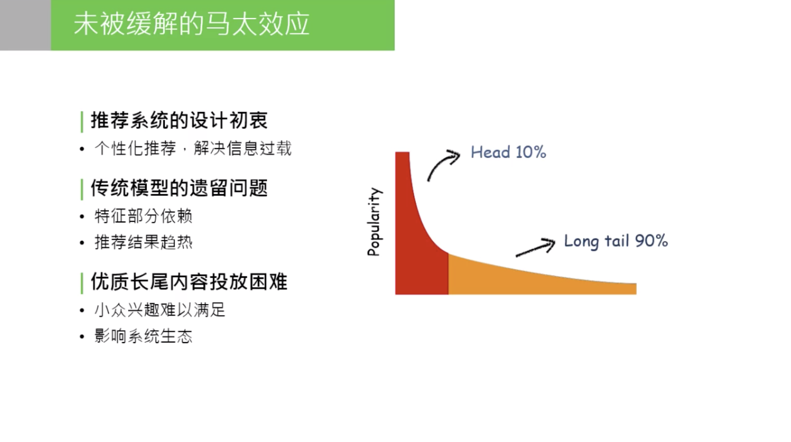
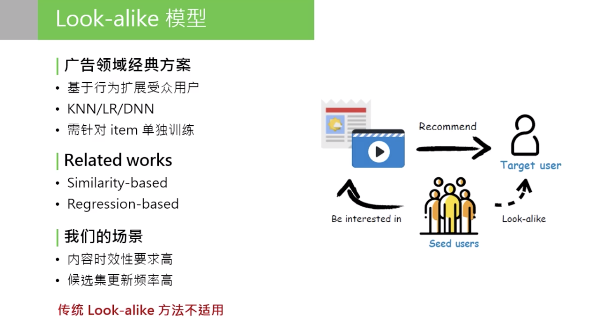
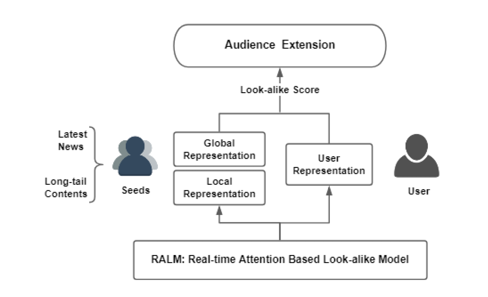
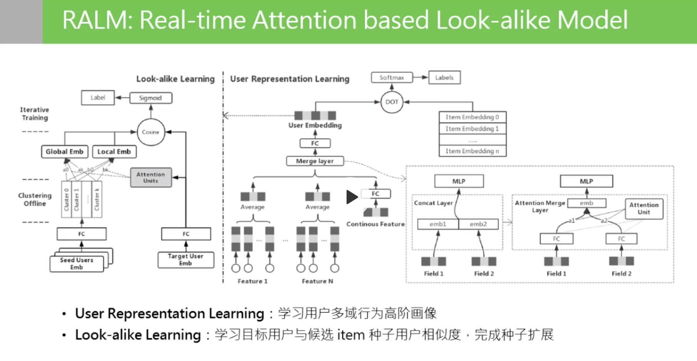
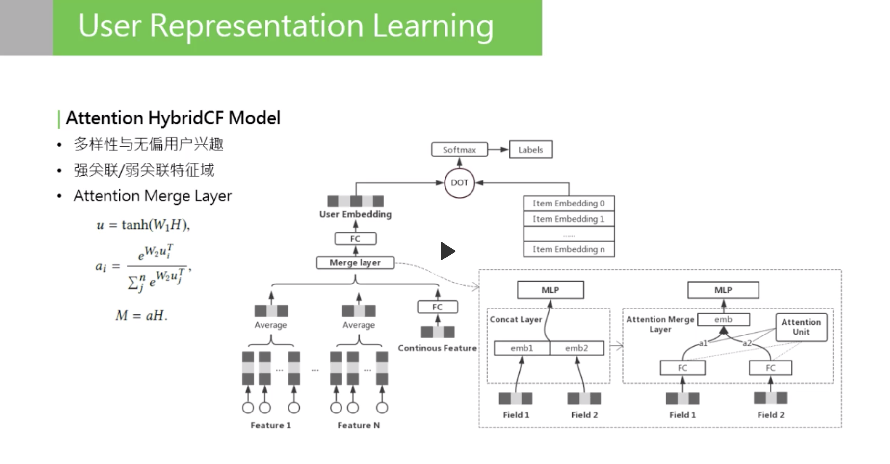
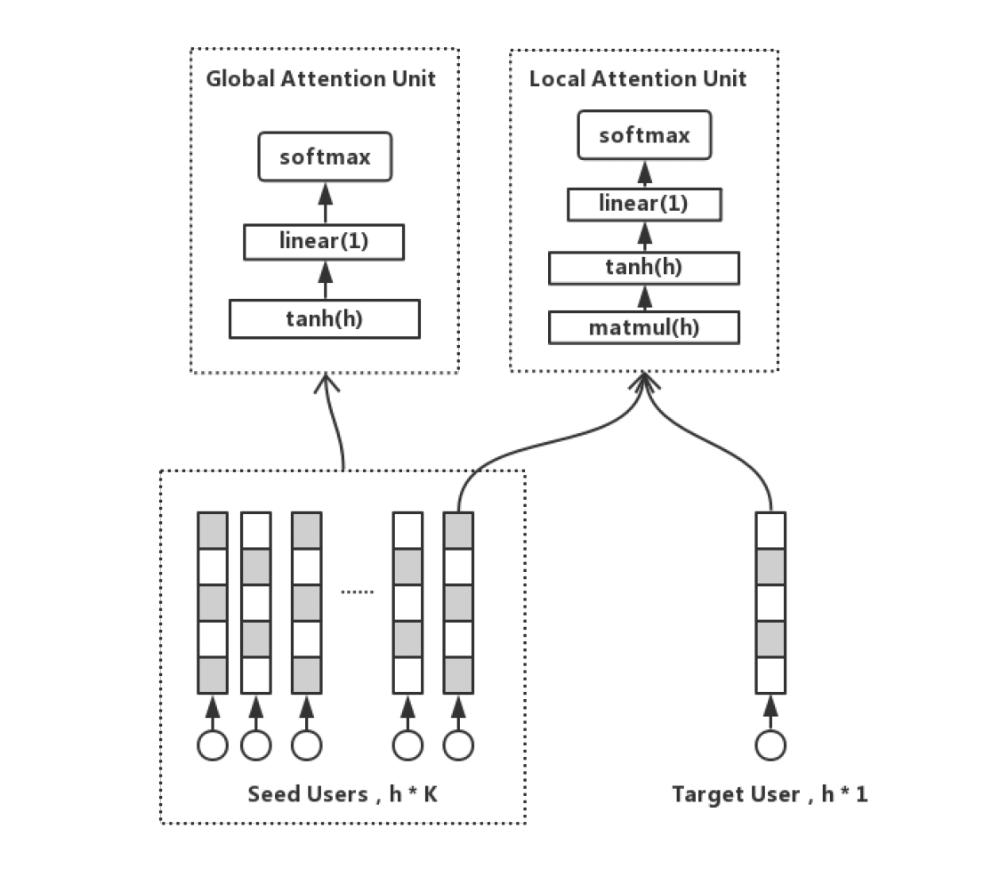
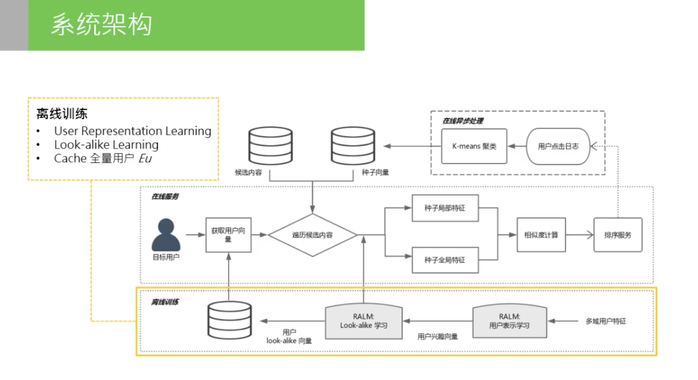
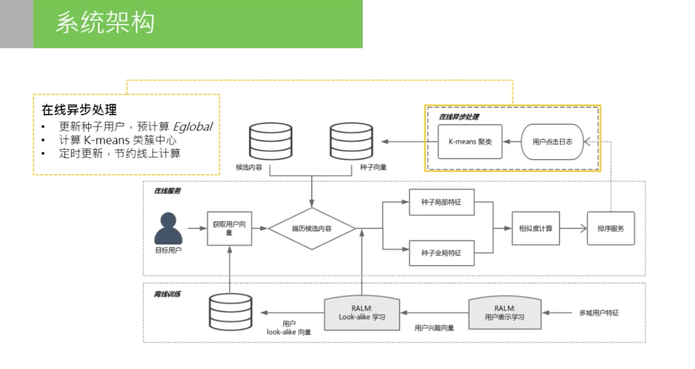
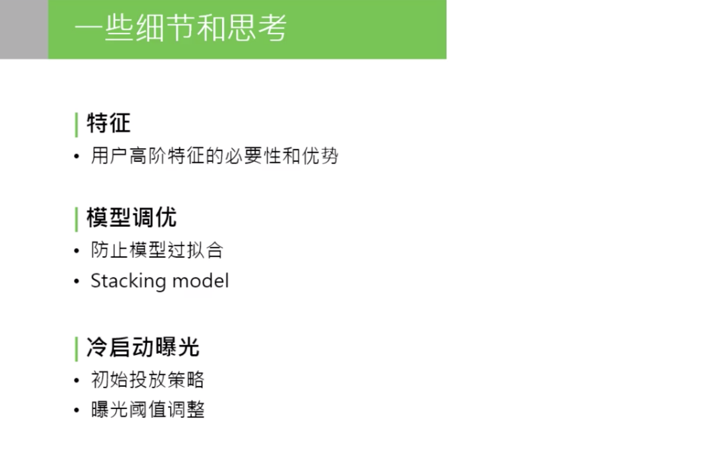

Real-time Attention Based Look-alike Model (RALM) for Recommender System

RALM is a similarity based look-alike model, which consists of user representation learning and look-alike learning.

## lookalike

<b>Lookalike，即相似人群扩展，是一种流行的受众拓展(audience extension)技术。具体过程是基于种子用户，通过一定的算法评估模型，找到更多拥有潜在关联性的相似人群的技术。</b>

Look-alike 是广告领域流行的一类方法，其核心思想是针对某个 item，先根据历史行为圈定一部分种子用户，然后通过模型寻找与种子用户相似的人群，为他们推荐该 item。

值得注意是，**lookalike不是某一种特定的算法，而是一类方法的统称**，这类方法综合运用多种技术，比如协同过滤、node2vec等，最终达到用户拓展目的。

对于特征和模型算法，不同的广告技术公司各有差异，特征取决于其DMP有哪些数据，主要方式有以下三种：

- 利用**用户画像**进行人群扩散：给种子用户打标签，利用相同标签找到目标人群
- 利用**分类模型**进行人群扩散：种子用户为正样本，候选对象为负样本，训练分类模型，然后用模型对所有候选对象进行筛选。
- 利用**社交网络**进行人群扩散：利用种子用户的好友关系，将其标签传给社区中的好友，从而实现人群扩散

## RALM

### 1. 背景

很多DNN的推荐模型，都会有严重的热门偏好，使得推荐系统的马太效应（Matthew effect）显著，很多长尾 的优质内容得不到有效的流量支持。

item 的历史行为特征对于 pCTR 的影响很大，这也造成模型推荐结果总体趋热（当然大多数场景下热文是大家都爱看的）。因此而来的副作用就是内容体系的马太效应没有得到充分缓解，一些优质的长尾内容，比如运营新闻专题、冷门类目精品等受到打压，无法得到高效的投放。

ItemCF：精确性OK，但是泛化性不OK。一般我们会对UID，IID做进一步的抽象，比如用户画像，商品画像。

做原始特征抽象，抽象意味着发生了信息损失，这部分信息损失导致模型拟合时走向了比较偏的道路。举个简单的例子：同一个 item，有相同的 topic tag，历史点击率和历史曝光次数和点击次数也相同，可以说这两个 item 是相同的吗？显然有可能是不同的。使用统计特征无法完整表达，同样的 item 点击都是0.5，PV 都是1000 or 2000。有些 item 被这群用户看过，有些 item 被那群用户看过。尽管语义特征和行为特征都相同，但两群 user 不同，Item 的受众也不同。这里说的抽象的方式，是不完整的 item 行为建模，也是对 item 历史行为不完整的刻画，这就导致了整个 model，对 item 后验数据十分依赖，导致推荐结果趋向于 CTR 表现好或者 PV 表现好的 item。最终后验数据表现好的数据又会更进一步被模型推荐且曝光，这样会造成恶性循环：一方面，加剧了头部效应的影响，使模型陷入局部最优；另一方面，整个推荐系统边界效应收窄，用户趋向于看之前表现好的数据，很少看到能拓宽推荐系统边界或者用户视野的长尾数据。

模型无法对 item 行为完整建模，这一步信息损失太大，一种解决方案是look-alike。

我们需要的是一个能精准建模 item 历史行为的模型。Look-alike 是广告领域流行的一类方法，其核心思想是针对某个 item，先根据历史行为圈定一部分种子用户，然后通过模型寻找与种子用户相似的人群，为他们推荐该 item。

目标Item => 种子用户 => look-alike => 目标用户 => 定向投放。

look-alike算法可以分成两类：similarity based methods and regression based methods.

1. similarity based:【效果差】

user embedding => 聚类【KMeans/局部敏感哈希】=> 近邻检索

2. regression based:【效果好，计算代价高】

训练2分类模型，负样本采样

由于 look-alike 充分利用了 item 的所有行为信息，因此在定向挖掘长尾内容受众上具有独特的优势。然而相较于广告系统，我们的资讯推荐有如下差异：

1. **内容时效性要求高**，一条新闻投放资讯生命周期一般不超过一天；
2. **候选集更新频率高**，一天可能有几十上百万条新内容出现。

传统的广告 look-alike 包括 similarity based models (LSH/user embedding) 和 regression based models (LR/xgboost/MLP)，在广告系统中都得到过验证，但不太适用于资讯推荐。这些模型往往都是针对每个 item 训练一个模型（或者每个 itemid 训练一个 embedding） ，当 item 候选集增加时，模型都需要首先积累样本，然后重训或增量更新，这对于高时效性高频率更新的资讯推荐系统来说是难以接受的。

模型：user to user，传统的CTR模型，user2item，point-wise的模型

user的表达是重点。RALM 模型能实现实时扩散的核心在于，我们使用种子用户的特征来代替 item 的历史行为特征，从而将常规 user-item 的模型转换成了 user-users 模型。

$I$表示item，用seeds representation来表示，即组成种子用户的每一个用户的embedding的函数$f$。$E_{seeds}$ 是 item 种子用户集合的表示。

模型分成两个阶段：

RALM 的训练包含两部分：User Representation learning 和 Look-alike learning。

User Representation learning 的任务是学习 $E_{u_{n}}$；

Look-alike learning 的任务则是基于$E_{u_{n}}$学习 $E_{seeds}$

---

User Representation => 高阶画像

seeds-to-user similarity calculation

- User Representation: 用attention merge layer代替concatenation

- Seeds Representation: global representation and local representation of seeds based on global and local attention units.

self-attention merge，改善强弱特征训练不均衡的问题。

表达种子用户群体。

1. 每个用户都有自己的兴趣，但对整个群体的人群信息存在不同的贡献度，我们称为群体的共性信息：global info。共性信息和目标用户无关，只和用户群体自身有关。
2. 种子用户群体的个性信息。种子群体中一定存在一小部分用户和 target 用户兴趣相似，这时，当 target 人群变化时，信息会变化，称为 local info。

种子用户的相对表达=个性信息+共性信息。怎样学习 local info 和 global info 呢？我们想到的是用不同的 attention 机制，学习出两个 embedding：local & global embedding，分别表示这两种信息。

Local attention：为了计算种子用户群体和目标用户的相似度，我们需要首先把多个用户向量 pooling 成一条。Average 是常用的 pooling 方式，但取均值的结果是趋向群体的中心，也就是大众化的兴趣，丢失了群体中的离群点和个性化兴趣。而一个群体中，必然只有一部分用户是和目标用户兴趣相仿的。基于这些假设，我们加入了 **local attention unit**，激活种子用户群的局部兴趣点，并且学习到一个和目标用户紧密关联的用户群表达方式。

local attention & global attention

 

聚类，优化计算效率：

模型是一个双塔结构。左边称为“seeds tower”，以种子用户的 embeddings 作为输入，经过一层空间转换（全连接 +pRELU），然后分别经过一个 self-attention 单元和一个 productive attention 单元，pooling 后输出向量；模型右边结构称为“target tower”，目标用户 embedding 输入后经过空间转换（与 seeds tower 共享参数），直接与左边向量计算 cosine 相似度。

​	

## REFERENCE

[论文地址：Real-time Attention Based Look-alike Model for Recommender System](https://arxiv.org/abs/1906.05022)

[作者知乎解读](https://zhuanlan.zhihu.com/p/71951411)

[Datafun-RALM: 实时 Look-alike 算法在微信看一看中的应用](https://mp.weixin.qq.com/s/b6XHZq6C0ZWOcDrysjMoog)

[推荐系统中如何做user embedding](https://www.zhihu.com/question/336110178)

[深度ctr预估中id到embedding目前工业界主流是端到端直接学习还是预训练?](https://www.zhihu.com/question/333087916/answer/741351044)

